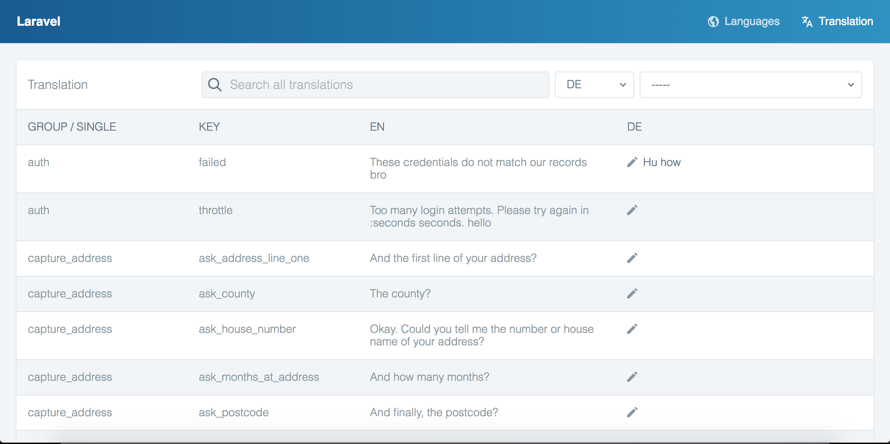

<div align="center">
  

  
Translation management for your Laravel application.




</div>

------

## About Laravel Translation

Laravel Translation is a package for Laravel 5 which allows you full control
over your translations when using [Laravel's
localization](https://laravel.com/docs/5.7/localization) functionality.

The package allows you to manage your translations using either the native file
based translations, but also provides a database driver which is useful in
multi-server setups.

It exposes a user interface allowing you to update existing and add new
translations to your application.

Below are a full list of features:

- File and database drivers
- Database translation loader (automatically load translations from the database
  when Laravel's translation retrieval methods and the database driver)
- User interface to add new languages and add and update translations
- Artisan commands to manage your translations
- Scan your application for missing translations

## Installation

Install the package via Composer

`composer require joedixon/laravel-translation`

Publish configuration and assets

`php artisan vendor:publish --provider="JoeDixon\Translation\TranslationServiceProvider"`

The service provider is loaded automatically using [package discovery](https://laravel.com/docs/5.7/packages#package-discovery).

## Usage

### Configuration

The package ships with a configuration file called `translation.php` which is published to the
config directory during installation. Below is an outline of the settings.

```
driver [file|database]
```
Choose either `file` or `database`. File translations utilise Laravel's native
file based translations and includes support for both `array` based and `json` based
language files.

```
route_group_config.middleware [string|array]
```
Apply middleware to the routes which ship with the package. For example, you may
which to use the `auth` middleware to ensure package user interface is only
accessible to logged in users.

```
translation_methods [array]
```
Choose which of Laravel's translation methods to use when searching for missing
translation keys.

```
scan_paths [array]
```
Choose which paths to use when searching for missing translations. Narrowing the
search to specific directories will result in a performance increase when
scanning for missing translations. 

```
ui_url [string]
```
Choose the root URL where the package user interface can be accessed. All routes
will be prefixed by this value.

e.g. setting this value to `languages` will result in URLs such as `translations/{language}/translations`

```
database.languages_table
```
Choose the name of the languages table when using the database driver.

```
database.translations_table
```
Choose the name of the translations table when using the database driver.

### Drivers

#### File
Utitlises Laravel's native php array and JSON based language files and exposes a
user interface to manage the enclosed translations. Add and update languages and translations
using either the user interface or the built-in [Artisan commands](https://laravel.com/docs/5.7/artisan).

#### Database
The database driver takes all of the functionality of Laravel's file based
language files, but moves the storage to the database, utilising the connection
configured for your Laravel application.

It also replaces the translation loader in the container so all of Laravel's
translation retrieval methods (`__()`, `trans()`, `@lang()`, etc) will load the
relevant strings from the database rather than the files without the need to
change any code in your application. It's a like for like swap.

To utilise the database driver, make sure to update the database table names in
the configuration file and run the migrations.

### User interface
Navigate to http://your-project.test/languages (update `languages` to match the
`translation.ui_url` configuration setting) and use the interface to manage
your translations.

First, click on the language you wish to edit. On the subsequent page, find the
translation you want to edit and click on the pencil icon or on the text and
make your edits. As soon as you remove focus from the input, your translation
will be saved, indicated by the green check icon.

### Artisan Commands
The package ships with a series of Artisan commands which assist with
translation management.

```
translation:add-language
```                  
Add a new language to the application.
  
```
translation:add-translation-key
```            
Add a new language key for the application.
  
```
translation:list-languages
```
List all of the available languages in the application.
  
```
translation:list-missing-translation-keys
```
List all of the translation keys in the app which don't have a corresponding translation.
  
```
translation:sync-translations
```             
Synchronise translations between drivers. This is useful if you have an exisitng
application using the native file based language files and wish to move to the
database driver. Running this command will take all of the translations from the
language files and insert them in to the database.

```
translation:sync-missing-translation-keys
```
This command will scan your project (using the paths supplied in the
configuration file) and create all of the missing translation keys. This can be
run for all languages or a single language.

