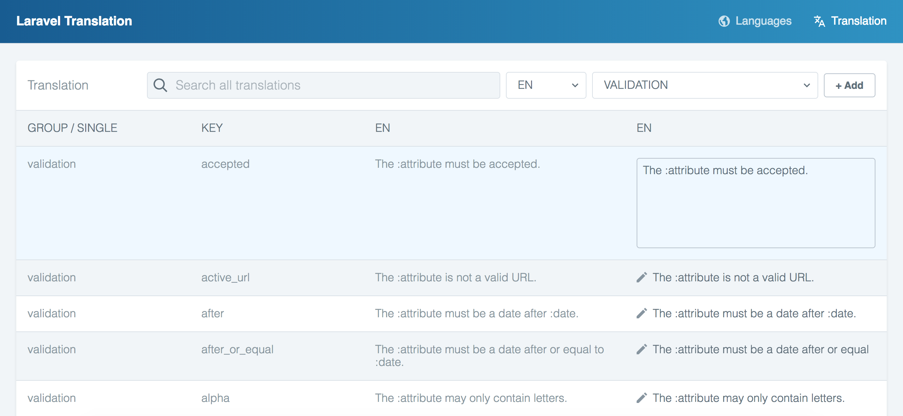

# Laravel Translation Manager

## Installation

Install the package via Composer

`composer require joedixon/laravel-translation`

Publish configuration and assets

`php artisan vendor:publish
--provider=JoeDixon\\Translation\\TranslationServiceProvider`

## Usage

Navigate to http://your-project.dev/translation and use the interface to manage
your translations.

First, click on the locale you wish to edit. On the subsequent page, find the
translation you want to edit and click on the pencil icon or on the text and
make your edits. As soon as you remove focus from the input, your translation
will be saved, indicated by the green check icon. 

